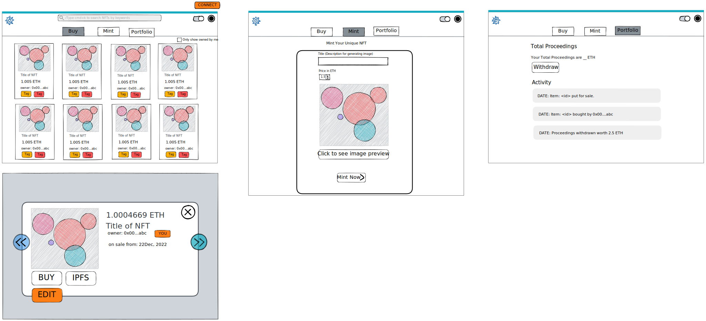

# About the Product

The idea is to build an NFT marketplace using AI generated images.
* **Buy** : User should be able to see all the available nfts which are up for sale. Also, add a filter to see only things which the account ownes.
* **Mint** : Provide a description which generates an image. I am thinking to use DALL-E apis (use [craiyon](https://github.com/topics/craiyon) as free, opensource for MVP now)- with ux inforced restrained rate limiting for this. Once the user is satisfied with the generated image, he can mint the nft & put it up for sale.
* **Portfolio** : Show the total proceedings of user with a pull-based withdrawl. Also, show the transaction history associated with this account. I am planning to use [theGraph](https://thegraph.com/en/) for database.
deploy on testnet

# Design

Basic layout using [excalidraw](https://excalidraw.com/) for the first draft of how the final product will look:

